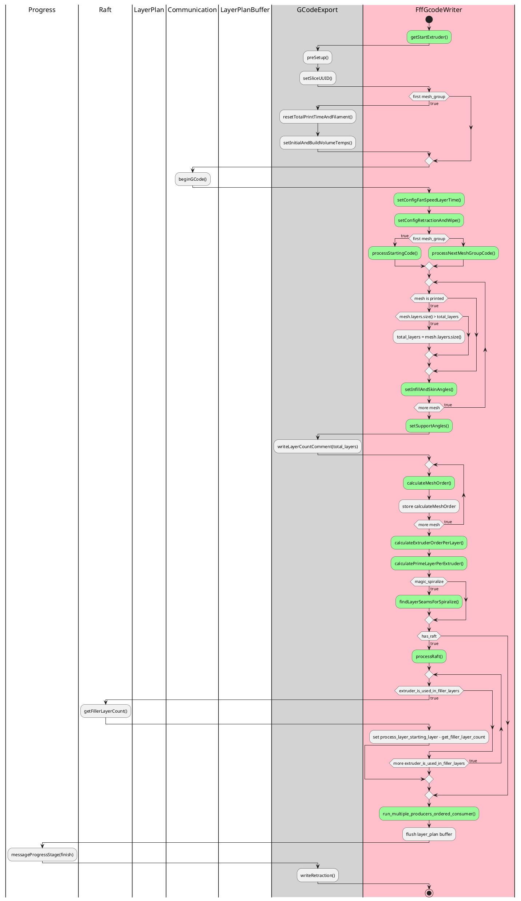
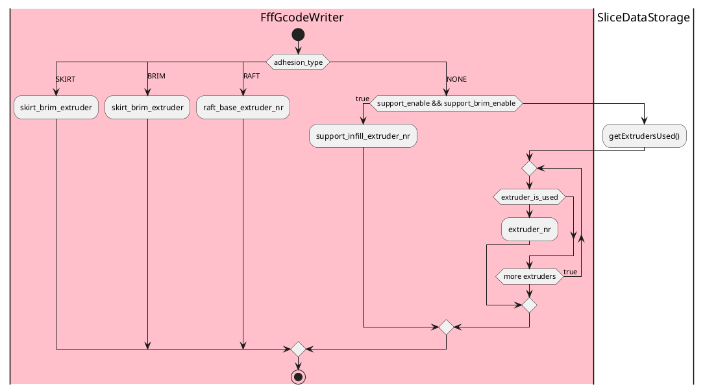
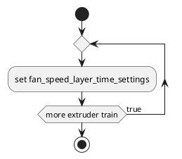
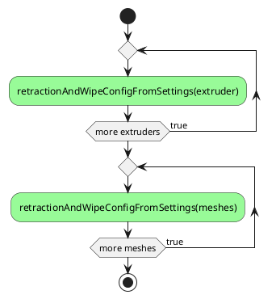
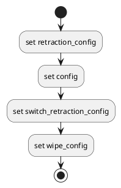
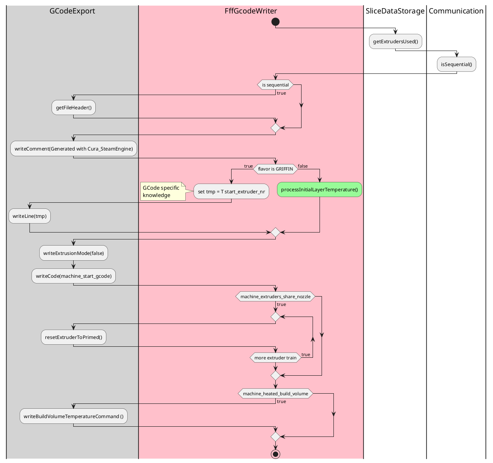
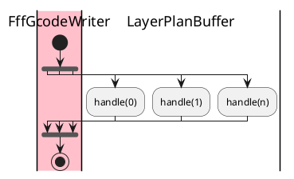
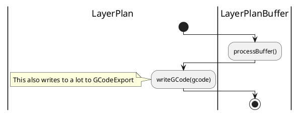
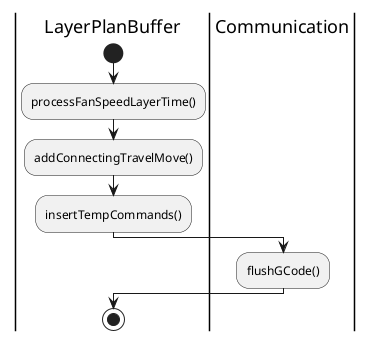

# writeGCode()

# getStartExtruder()

# setConfigFanSpeedLayerTime()

# setConfigRetractionAndWipe()

# retractionAndWipeConfigFromSettings()

# processStartingCode()

# processInitialLayerTemperature()

# processNextMeshGroupCode()

# setInfillAndSkinAngles()

# setSupportAngles()

# calculateMeshOrder()

# calculateExtruderOrderPerLayer()

# calculatePrimeLayerPerExtruder()

# findLayerSeamsForSpiralize()

# processRaft()

# run_multiple_producers_ordered_consumer()

## handle()

### processBuffer()

